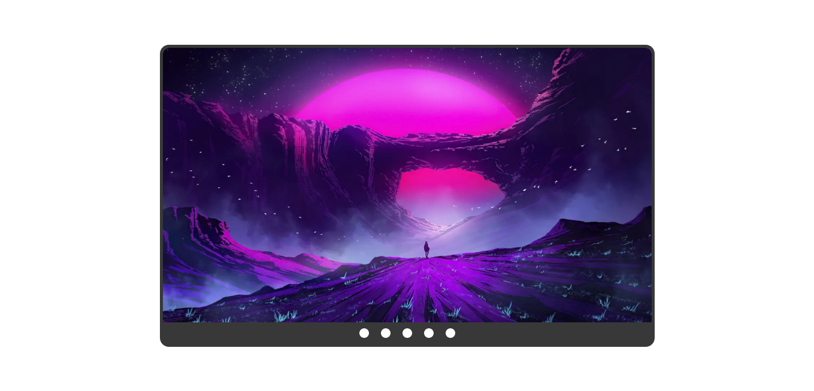

# Image Slider

> I did it for a simple test from a JavaScript course. 

I used <em>Gimp</em> to edit the images in a relative good size and format, 
tried to make a good script aiming the reusability and scalability, 
but without using <em>Libraries</em> or <em>Frameworks</em>.

<h2>🛠 &nbsp;Builded with:</h2>

&nbsp;
 
&nbsp;
 
&nbsp;
 
&nbsp;
 

<h2>⚙️ &nbsp;Other Technologies used:</h2>

&nbsp;
 
&nbsp;
 
&nbsp;
 
**&nbsp; Extensions**
<ul>
  <li><em>Live Sass Compiler</em></li>
  <li><em>Scss Intellisense</em></li>
  <li><em>Live server</em></li>
</ul>
